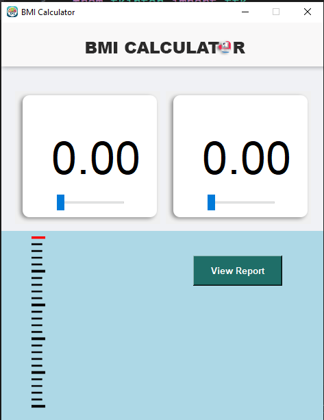

# 🔢 BMI Calculator App using Tkinter

The BMI Calculator App is a user-friendly Python-based GUI application built using Tkinter 🐍. It allows users to calculate their Body Mass Index (BMI) 🧍‍♂️🧍‍♀️ by entering their height (in centimeters 📏) and weight (in kilograms ⚖️) using interactive sliders 🎚️. The app features real-time updates, intuitive visuals, and categorized health feedback.

## 🚀 Features

- **🖥️ Graphical Interface with Tkinter**  
    Clean and modern interface built with Tkinter.

- **🎚️ Interactive Sliders**  
    Sliders to input height and weight with real-time visual representation.

- **🧍‍♂️ Animated Avatar**  
    Dynamic avatar adjusts height based on input.

- **📈 Live BMI Calculation**  
    Automatically calculates and displays the BMI as input changes.

- **🧠 BMI Categorization**  
    Shows health status like "Underweight", "Normal", "Overweight", or "Obese" with suggestions.

## 🧠 Learning Highlights

This project is great for beginners and covers:

- GUI development with Tkinter
- Real-time data handling with sliders
- Dynamic image resizing using Pillow
- Basic arithmetic logic in health tech
- Clean UI/UX design for desktop applications

## 🖼️ Screenshots

Add screenshots of your app here, e.g., showing the sliders and BMI result area.  
Place them in a `/screenshots/` folder and reference them here like:


## 🧰 Requirements

Install the required libraries:

```bash
pip install tkinter pillow
```

## 🔧 Future Improvements

- Add unit selection (cm/inch, kg/lbs)
- Store BMI history
- Export BMI report as PDF
- Add graphical BMI chart

## 📌 Conclusion

This BMI Calculator project is perfect for beginners exploring GUI apps in Python. It’s a hands-on way to learn Tkinter, event handling, and basic image manipulation using Pillow. Customize it further to suit your learning or portfolio goals!